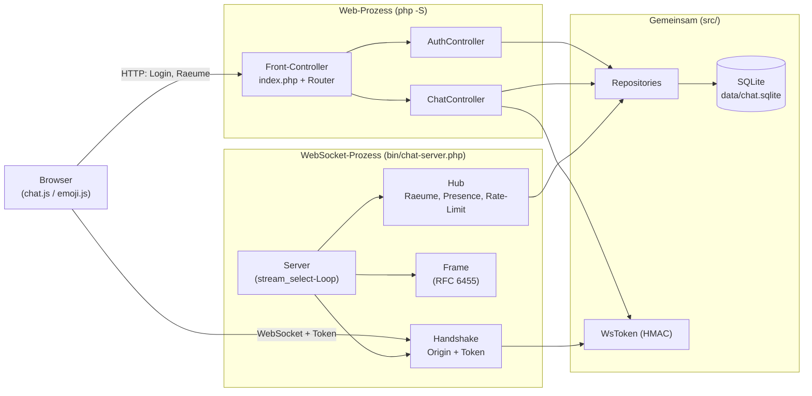
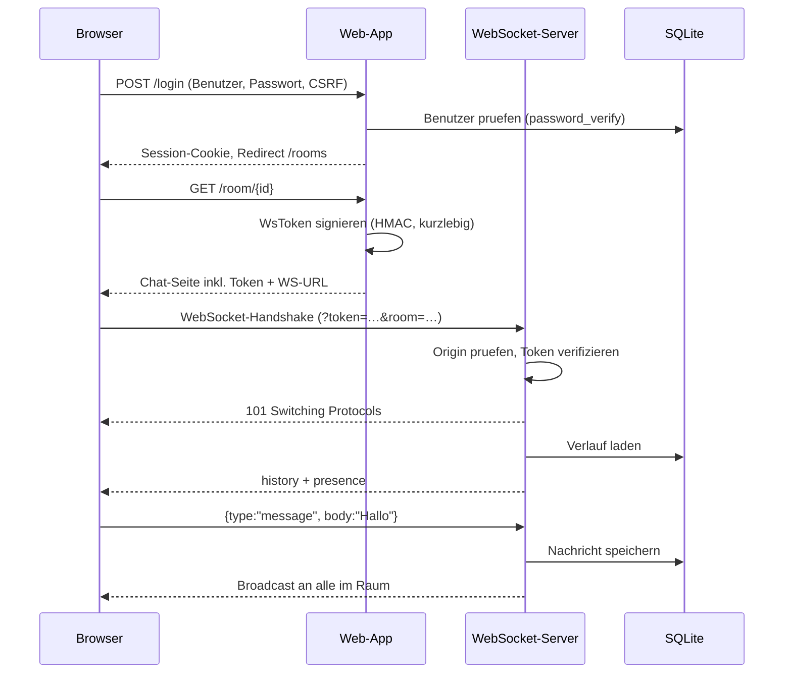

# PHP WebSocket Chat

Ein professioneller Echtzeit-Gruppenchat auf Basis von **reinem PHP** – ohne
Composer, ohne npm, ohne externe Libraries. Der WebSocket-Server ist von Grund
auf nach RFC 6455 implementiert, die Daten liegen in einer SQLite-Datei, das
Frontend ist modernes Vanilla-JavaScript.

> Diese Version ist eine vollstaendige, sicherheitsbereinigte Neufassung eines
> ueber fuenf Jahre alten Prototyps. Was am alten Stand nicht funktionierte und
> wie es geloest wurde, steht in [`docs/RETROSPECTIVE.md`](docs/RETROSPECTIVE.md).

---

## Was kann die App?

- **Registrierung & Login** mit sicher gehashten Passwoertern (`password_hash`).
- **Chatraeume** erstellen und betreten (Gruppenchats).
- **Echtzeit-Nachrichten** ueber WebSockets, an alle Mitglieder eines Raums.
- **Nachrichtenverlauf**: beim Betreten werden die letzten Nachrichten geladen
  (persistiert in SQLite).
- **Online-Userliste** pro Raum (Presence) inkl. Live-Status-Anzeige.
- **Emoji-Auswahl** mit kategorisiertem Picker.
- **Zeitstempel**, Nachrichten-Gruppierung, aus dem Namen abgeleitete
  Avatar-Farben.
- **Automatischer Reconnect** bei Verbindungsabbruch.
- Helles und dunkles Design (folgt der Systemeinstellung), responsiv.

---

## Voraussetzungen

- **PHP 8.1 oder neuer** (getestet mit PHP 8.5) mit den Erweiterungen
  `sockets`/`streams`, `pdo_sqlite`, `mbstring`, `openssl`, `json`
  (alle sind in Standard-PHP-Builds enthalten).
- Ein Unix-artiges System fuer `bin/start.sh` (macOS/Linux). Unter Windows
  koennen die beiden Prozesse manuell gestartet werden (siehe unten).

Es wird **kein** Datenbankserver, **kein** Composer und **kein** Webserver wie
Apache/Nginx benoetigt.

---

## Schnellstart

```bash
git clone <repo> php-websocket-chat
cd php-websocket-chat
bin/start.sh
```

Danach im Browser oeffnen: **http://127.0.0.1:8000**

Registriere einen Benutzer, lege einen Raum an und oeffne den Raum in einem
zweiten Browserfenster (oder mit einem zweiten Benutzer), um den Live-Chat zu
sehen.

Beim ersten Start werden die SQLite-Datenbank (`data/chat.sqlite`) und das
Schema automatisch angelegt.

### Manueller Start (z. B. Windows, zwei Terminals)

```bash
# Terminal 1 – Web-App
php -S 127.0.0.1:8000 -t public public/router.php

# Terminal 2 – WebSocket-Server
php bin/chat-server.php
```

Wichtig: In diesem Fall muss fuer beide Prozesse dasselbe `APP_SECRET` gesetzt
sein (sonst schlaegt die Token-Pruefung fehl). Entweder eine Umgebungsvariable
`APP_SECRET` in beiden Terminals setzen, oder das automatisch erzeugte
`data/app_secret.key` verwenden (beide Prozesse lesen dieselbe Datei, wenn
`APP_SECRET` nicht gesetzt ist).

---

## Konfiguration

Alle Werte haben sinnvolle Defaults und koennen per Umgebungsvariable ueberschrieben werden:

| Variable          | Default                                             | Bedeutung                                    |
|-------------------|-----------------------------------------------------|----------------------------------------------|
| `WEB_HOST`        | `127.0.0.1`                                         | Host der Web-App                             |
| `WEB_PORT`        | `8000`                                              | Port der Web-App                             |
| `WS_HOST`         | `127.0.0.1`                                         | Host des WebSocket-Servers                   |
| `WS_PORT`         | `8080`                                              | Port des WebSocket-Servers                   |
| `WS_PUBLIC_URL`   | `ws://<WEB_HOST>:<WS_PORT>`                          | WebSocket-URL, die der Browser nutzt         |
| `ALLOWED_ORIGINS` | `http://<WEB_HOST>:<WEB_PORT>, http://localhost:...`| Erlaubte Origins fuer den WS-Handshake       |
| `APP_SECRET`      | zufaellig, persistiert in `data/app_secret.key`     | Signaturschluessel der WebSocket-Tokens      |
| `DB_PATH`         | `data/chat.sqlite`                                  | Pfad zur SQLite-Datei                        |

---

## Architektur

Zwei PHP-Prozesse teilen sich denselben Code (`src/`) und dieselbe SQLite-Datei:
die klassische Web-App liefert HTML/Assets aus und authentifiziert; der
WebSocket-Server haelt die Echtzeit-Verbindungen.



Ablauf von der Anmeldung bis zur ersten Nachricht:



---

## Sicherheit

Der alte Prototyp hatte zahlreiche Schwachstellen. Diese Fassung adressiert sie:

- **XSS**: Nachrichten werden als Rohtext gespeichert und im Client
  ausschliesslich per `textContent` gerendert; alle Server-Templates escapen
  ueber `e()`. Zusaetzlich eine restriktive **Content-Security-Policy**.
- **WebSocket-Authentifizierung**: Der Handshake verlangt ein **HMAC-signiertes,
  kurzlebiges Token**, das an die Web-Session gebunden ist. Die Identitaet
  stammt nie aus clientseitig gesendeten Feldern → kein Identitaets-Spoofing.
- **Origin-Pruefung** beim Handshake (Schutz vor Cross-Site WebSocket Hijacking).
- **CSRF-Token** in allen Formularen; **Session-Regenerierung** nach dem Login;
  `HttpOnly`/`SameSite`-Cookies.
- **Prepared Statements** ueberall (ein einziges PDO-Layer, kein mysqli-Wildwuchs).
- **Rate-Limit** und **Laengenbegrenzung** fuer Nachrichten im Server.
- **Keine hartcodierten Zugangsdaten**: SQLite braucht keine, das Token-Secret
  wird zufaellig erzeugt und liegt ausserhalb der Versionskontrolle.
- Fehlermeldungen werden nicht an den Client geleakt.

### Produktion / Verschluesselung (wss)

Fuer den Betrieb hinter HTTPS sollte der WebSocket ueber `wss://` laufen. Das
erreicht man ueblicherweise mit einem Reverse-Proxy (z. B. Nginx oder Caddy),
der TLS terminiert und `/ws` an den PHP-WebSocket-Prozess weiterreicht. Dann:

- `WS_PUBLIC_URL=wss://deine-domain/ws` setzen,
- `ALLOWED_ORIGINS=https://deine-domain` setzen,
- in `src/Core/Session.php` das `secure`-Cookie-Flag aktivieren.

---

## Projektstruktur

```
bin/            Start-Skript und WebSocket-Server-Einstieg
config/         Bootstrap (Autoloader) und Konfiguration
public/         Document-Root: Front-Controller, Router, CSS/JS
src/
  Core/         Router, Request, View, Session, Csrf, Config, Http
  Database/     PDO-Verbindung, Migrator
  Repository/   User-, Room-, MessageRepository
  Auth/         AuthService, WsToken
  Controller/   Auth- und ChatController
  WebSocket/    Frame, Handshake, Connection, Hub, Server
views/          PHP-Templates (escaped)
tests/          Dependency-freier Test-Runner + Tests
docs/           Design-Spec, Plan, Retrospektive
data/           SQLite-Datenbank + App-Secret (nicht im Repo)
```

---

## Tests

Automatisierte Unit-Tests (ohne Netzwerk, dependency-frei):

```bash
php tests/run.php
```

Abgedeckt sind u. a. Migrator, Repositories, WsToken, CSRF/Escaping, Router,
AuthService, Raumnamen-Validierung, WebSocket-Framing, Handshake und die
Hub-Logik (Broadcast, Rate-Limit, Presence).

---

## Lizenz

Frei zur privaten und lehrbezogenen Nutzung.
